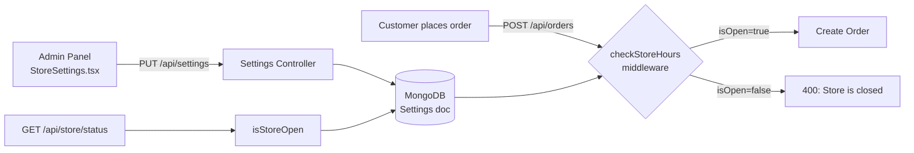

# Store Hours Feature — Analysis Report

**Project:** Project Roma (Bal-Port Liquors)
**Date:** April 16, 2026
**Scope:** Full-stack analysis of the Store Hours / Operating Hours feature

---

## 1. Feature Overview

The Store Hours feature controls **when the store accepts online orders**. It consists of the following components:

| Layer | File | Purpose |
|-------|------|---------|
| **Model** | [settings.js](file:///c:/Users/User/Desktop/Project-Roma/backend/src/models/settings.js) | Mongoose schema: 7-day `operatingHours` array + `timezone` |
| **Middleware** | [checkStoreHours.js](file:///c:/Users/User/Desktop/Project-Roma/backend/src/middleware/checkStoreHours.js) | `isStoreOpen()` logic + `checkStoreHours` middleware that blocks orders |
| **Controller** | [settings.js](file:///c:/Users/User/Desktop/Project-Roma/backend/src/controllers/settings.js) | `GET /api/settings` (read) and `PUT /api/settings` (update) |
| **Routes** | [store.js](file:///c:/Users/User/Desktop/Project-Roma/backend/src/routes/store.js) | `GET /api/store/status` — returns `isOpen`, `message`, `schedule` |
| **Routes** | [settings.js](file:///c:/Users/User/Desktop/Project-Roma/backend/src/routes/settings.js) | `GET` / `PUT /api/settings` — CRUD for hours config |
| **Routes** | [order.js](file:///c:/Users/User/Desktop/Project-Roma/backend/src/routes/order.js) | `POST /api/orders` — applies `checkStoreHours` middleware before creating an order |
| **Admin UI** | [StoreSettings.tsx](file:///c:/Users/User/Desktop/Project-Roma/admin-panel/src/pages/StoreSettings.tsx) | Admin form to toggle days open/closed, set open/close times |
| **Customer UI** | *(none)* | ❌ No customer-facing integration exists |

### Data Flow



---

## 2. Bugs & Issues Found

### 🔴 BUG #1 — "Next Open Day" logic skips valid days (CRITICAL)

**File:** [checkStoreHours.js:56](file:///c:/Users/User/Desktop/Project-Roma/backend/src/middleware/checkStoreHours.js#L56)

```javascript
const nextOpenDay = storeConfig.operatingHours.find(
    (h, index) => index > dayOfWeek && h.isOpen
) || storeConfig.operatingHours.find(h => h.isOpen);
```

> [!CAUTION]
> This uses `index` (the array iteration position) instead of `h.dayOfWeek` (the actual day number). If the `operatingHours` array is **not sorted by `dayOfWeek`** — which is entirely possible since MongoDB doesn't guarantee subdocument order — this logic will return the **wrong next open day** or skip valid days entirely.

**Impact:** The user-facing "We will be open on…" message may show a completely wrong day.

**Fix:** Replace `index > dayOfWeek` with `h.dayOfWeek > dayOfWeek`:
```diff
- const nextOpenDay = storeConfig.operatingHours.find(
-     (h, index) => index > dayOfWeek && h.isOpen
- ) || storeConfig.operatingHours.find(h => h.isOpen);
+ const sortedHours = [...storeConfig.operatingHours].sort((a, b) => a.dayOfWeek - b.dayOfWeek);
+ const nextOpenDay = sortedHours.find(
+     h => h.dayOfWeek > dayOfWeek && h.isOpen
+ ) || sortedHours.find(h => h.isOpen);
```

---

### 🔴 BUG #2 — No error handling in `checkStoreHours` middleware (CRITICAL)

**File:** [checkStoreHours.js:69-78](file:///c:/Users/User/Desktop/Project-Roma/backend/src/middleware/checkStoreHours.js#L69-L78)

```javascript
const checkStoreHours = async (req, res, next) => {
    const { isOpen, message } = await isStoreOpen();
    // ← no try/catch!
```

> [!WARNING]
> If the database call inside `isStoreOpen()` fails (e.g., MongoDB is down, connection timeout), the middleware will throw an **unhandled promise rejection**, crashing the request with a generic 500 error or worse — **crashing the server** on older Node.js versions.

**Fix:**
```diff
 const checkStoreHours = async (req, res, next) => {
+    try {
         const { isOpen, message } = await isStoreOpen();
         if (!isOpen) {
             return res.status(400).json({
                 success: false,
                 message: message || "Sorry, the store is currently closed."
             });
         }
         next();
+    } catch (error) {
+        console.error('Store hours check failed:', error);
+        // Fail open: allow the order if the check itself fails
+        next();
+    }
 };
```

---

### 🔴 BUG #3 — Customer panel has ZERO store-hours integration (CRITICAL)

**Files:** All files under `customer-panel/src/`

> [!IMPORTANT]
> The customer storefront **never calls** `/api/store/status` or `/api/settings`. There is:
> - ❌ No banner/notification telling the customer the store is closed
> - ❌ No check before adding items to cart
> - ❌ No pre-checkout validation
> - ❌ No display of store operating hours anywhere in the UI

**What happens today:** A customer can browse, add items to cart, fill in billing details, enter credit card info, and **only then** get a generic `400` error from the server: `"Sorry, the store is currently closed and cannot accept orders."` — after they've already entered their payment info. This is a **terrible user experience**.

**Fix:** The customer panel needs:
1. A call to `GET /api/store/status` on app load
2. A global banner when `isOpen === false` displaying the `message`
3. Disable the "Place Order" button when the store is closed
4. Optionally display the store's weekly schedule in the footer or a dedicated section

---

### 🟡 BUG #4 — Admin panel doesn't expose timezone editing (MEDIUM)

**File:** [StoreSettings.tsx:61-68](file:///c:/Users/User/Desktop/Project-Roma/admin-panel/src/pages/StoreSettings.tsx#L61-L68)

```typescript
const payload = {
    timezone: settings?.data?.timezone, // just passes through whatever was fetched
    operatingHours,
};
```

The admin panel **reads** the timezone from the API but provides **no UI** to change it. The timezone is hardcoded to `America/Los_Angeles` in the model defaults. If the store needs to switch timezones, an admin would have to make a direct API call.

**Fix:** Add a timezone dropdown (e.g., using a select with common US timezones) to the `StoreSettings.tsx` form.

---

### 🟡 BUG #5 — Sunday-to-Monday overnight hours edge case (MEDIUM)

**File:** [checkStoreHours.js:19](file:///c:/Users/User/Desktop/Project-Roma/backend/src/middleware/checkStoreHours.js#L19)

```javascript
const yesterday_schedule = storeConfig.operatingHours.find(
    h => h.dayOfWeek === (dayOfWeek === 0 ? 6 : dayOfWeek - 1)
);
```

The code correctly wraps Sunday (0) → Saturday (6) for "yesterday". However, the **default schedule** in the model sets Sunday's closing time as `23:59`:

```javascript
{ dayOfWeek: 0, day: 'Sunday', isOpen: true, open: '07:00', close: '23:59' },
```

While Monday has `close: '02:00'` (next-day). This means Sunday closes at 23:59 and Monday opens at 06:00 — leaving a **6+ hour dead zone** where the store is shown as closed. This may be intentional, but it's worth noting that the Sunday schedule is **inconsistent** with the rest of the week.

---

### 🟡 BUG #6 — No input validation on operating hours format (MEDIUM)

**File:** [settings.js (controller)](file:///c:/Users/User/Desktop/Project-Roma/backend/src/controllers/settings.js#L18-L36)

The `updateSettings` controller only checks that `operatingHours` is an array. It does **not** validate:
- That `open` and `close` are valid `HH:mm` strings
- That `dayOfWeek` is 0–6
- That `day` matches the `dayOfWeek`
- That exactly 7 days are provided
- That there are no duplicate `dayOfWeek` entries

**Impact:** Malformed data can break the `isStoreOpen()` logic silently (e.g., `open: "25:99"` would pass string comparison but produce nonsense results).

**Fix:** Add validation using the existing `validators.js` pattern:
```javascript
for (const hour of operatingHours) {
    if (typeof hour.dayOfWeek !== 'number' || hour.dayOfWeek < 0 || hour.dayOfWeek > 6) {
        return res.status(400).json({ success: false, message: 'Invalid dayOfWeek value.' });
    }
    const timeRegex = /^([01]\d|2[0-3]):[0-5]\d$/;
    if (!timeRegex.test(hour.open) || !timeRegex.test(hour.close)) {
        return res.status(400).json({ success: false, message: 'Time must be in HH:mm format.' });
    }
}
```

---

### 🟢 BUG #7 — `GET /api/store/status` endpoint path mismatch with docs (LOW)

**File:** [CLAUDE.md:151](file:///c:/Users/User/Desktop/Project-Roma/CLAUDE.md#L151)

The documentation says:
```
GET /api/store/hours
```

But the actual route is:
```
GET /api/store/status
```

**Impact:** Documentation is wrong — could confuse developers.

---

### 🟢 BUG #8 — Delivery quote endpoint is NOT guarded by store hours (LOW)

**File:** [order.js:11](file:///c:/Users/User/Desktop/Project-Roma/backend/src/routes/order.js#L11)

```javascript
router.post('/orders', checkStoreHours, orderRoutes.createOrder);
router.post('/orders/delivery-quote', orderRoutes.getDeliveryQuote); // ← no guard!
```

A customer can request a delivery quote when the store is closed. While this doesn't create an order, it does call the DoorDash API unnecessarily and could give the customer a false impression that they can place an order.

---

### 🟢 BUG #9 — `isStoreOpen()` message doesn't include the day name (LOW)

**File:** [checkStoreHours.js:58-59](file:///c:/Users/User/Desktop/Project-Roma/backend/src/middleware/checkStoreHours.js#L58-L59)

```javascript
message = `We are closed today. We will be open on the next business day at ${openTime}.`;
```

The message says "next business day" but doesn't say **which** day (e.g., "Monday"). This is a poor UX for the customer.

**Fix:**
```diff
- message = `We are closed today. We will be open on the next business day at ${openTime}.`;
+ message = `We are closed today. We will be open on ${nextOpenDay.day} at ${openTime}.`;
```

---

## 3. Summary Table

| # | Severity | Issue | Component |
|---|----------|-------|-----------|
| 1 | 🔴 Critical | Next-open-day logic uses array index instead of `dayOfWeek` | Backend middleware |
| 2 | 🔴 Critical | No try/catch in `checkStoreHours` middleware — can crash server | Backend middleware |
| 3 | 🔴 Critical | Customer panel has zero store-hours integration — bad UX | Customer panel |
| 4 | 🟡 Medium | Admin panel can't change timezone | Admin panel |
| 5 | 🟡 Medium | Sunday schedule is inconsistent with weekday pattern | Backend model defaults |
| 6 | 🟡 Medium | No server-side validation on operating hours input | Backend controller |
| 7 | 🟢 Low | Docs say `/api/store/hours`, actual is `/api/store/status` | Documentation |
| 8 | 🟢 Low | Delivery quote endpoint not guarded by store hours | Backend routes |
| 9 | 🟢 Low | "Next business day" message doesn't include the day name | Backend middleware |

---

## 4. Recommendation: Priority Fix Order

1. **BUG #3** — Add store-hours integration to customer panel (biggest UX gap)
2. **BUG #2** — Add try/catch to middleware (server stability)
3. **BUG #1** — Fix next-open-day logic (incorrect info to customers)
4. **BUG #6** — Add input validation (data integrity)
5. **BUG #4** — Add timezone selector to admin UI
6. **BUG #9** — Improve closed message to include day name
7. **BUG #7** — Fix documentation
8. **BUG #8** — Guard delivery-quote endpoint
9. **BUG #5** — Review Sunday schedule defaults
